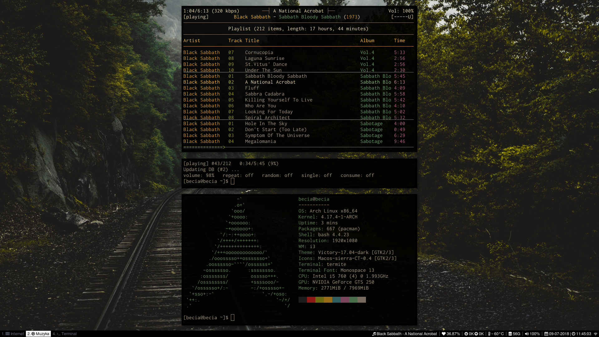
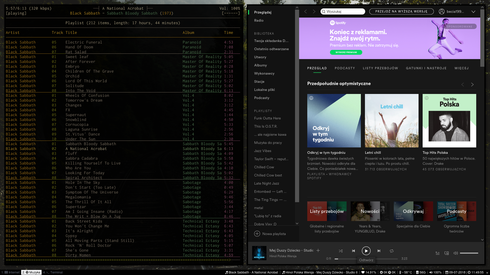
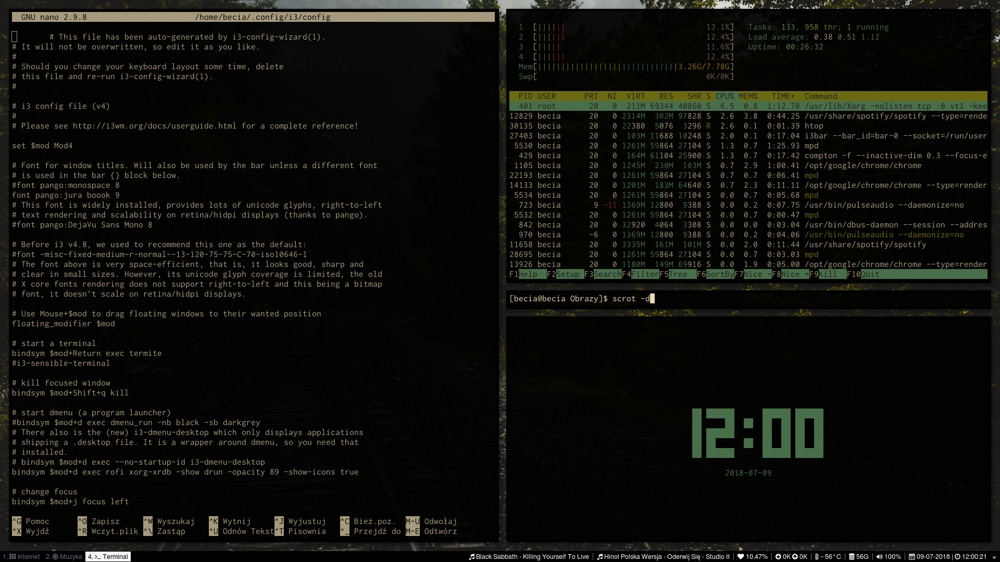
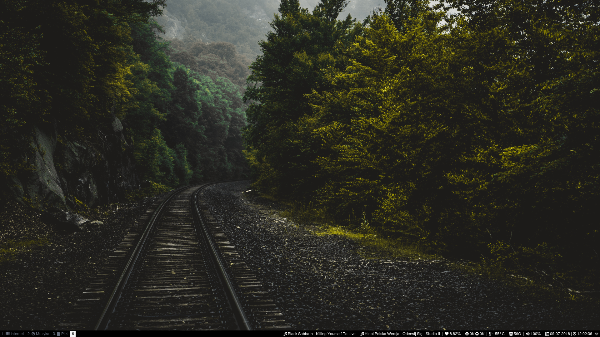

# [i3-gaps] My Arch Linux dotfiles :)

I use Arch Linux with i3-gaps + i3blcoks
If you want to get desktop look like mine you need to have:
* i3-gaps
* i3-blocks
* ttf-font-awesome
* ttf-font-awesome-4
* font Jura Book
* Termite
* ncmpcpp
* Vertex Icon Pack - https://www.gnome-look.org/p/1080254/
* Victory Theme - https://github.com/horst3180/vertex-icons
  or
* MacOs sierra Ct icon pack - https://www.gnome-look.org/p/1210856/
* Rofi [comming_soon]

